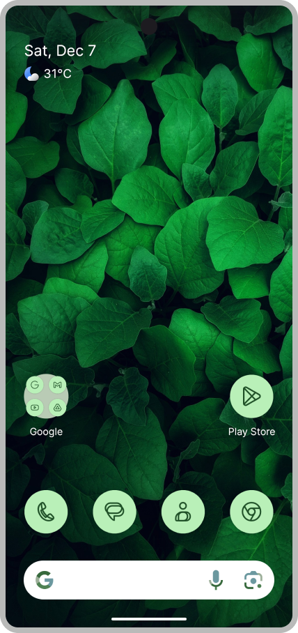

# Lawnchair 15

<picture>
    <!-- Avoid image being clickable with slight workaround -->
    <!-- ❤️ Credit to Raine for the original mockup on the Lawnchair Discord -->
    <!-- ❤️ Credit to Lawrence Kayku for the current mockup on Unsplash 
            https://unsplash.com/photos/photography-of-green-leaves-ZVKr8wADhpc 
    -->
    <source media="(prefers-color-scheme: dark)" srcset="docs/assets/device-frame.png" width="250px">
    
</picture>

Lawnchair is a free, open-source home app for Android. Taking Launcher3—Android’s default home app—as a starting point, it ports Pixel Launcher features and introduces rich customization options.

This branch houses the codebase of Lawnchair 15, which is currently in development and is based on Launcher3 from Android 15. For Lawnchair 9 to 14, see the branches with the `9-` to `14-` prefixes, respectively.

## Features

-   **Material You Theming:** Adapts to your wallpaper and system theme.
-   **At a Glance Widget:** Displays information *at a glance* with support for [Smartspacer](https://github.com/KieronQuinn/Smartspacer) extensions.
-   **QuickSwitch Support:** Integrates with Android Recents on Android 10 and newer. (requires root)
-   **Global Search:** Allows quick access to apps, contacts, and web results from the home screen.
-   **Customization Options:** Provides options to tweak icons, fonts, and colors to your liking.
-   And more!

## Download

  <a href="https://play.google.com/store/apps/details?id=app.lawnchair.play">
    <picture>
      <!-- Avoid image being clickable with slight workaround -->
      <source media="(prefers-color-scheme: dark)" srcset="docs/assets/badge-google-play.png" height="60">
      
    </picture>
  </a>
  <a href="https://apt.izzysoft.de/fdroid/index/apk/app.lawnchair">
    <picture>
      <source media="(prefers-color-scheme: dark)" srcset="docs/assets/badge-izzyondroid.png" height="60">
      
    </picture>
  </a>
  <a href="https://apps.obtainium.imranr.dev/redirect?r=obtainium://add/https://github.com/LawnchairLauncher/lawnchair/">
    <picture>
      <source media="(prefers-color-scheme: dark)" srcset="docs/assets/badge-obtainium.png" height="60">
      
    </picture>
  </a>
    <a href="https://github.com/LawnchairLauncher/lawnchair/releases/latest">
    <picture>
      <source media="(prefers-color-scheme: dark)" srcset="docs/assets/badge-github.png" height="60">
      
    </picture>
  </a>

Lawnchair on Play Store will install as a different app from other sources. Some features may be restricted to comply with Google Play's publishing rules.

### Development builds

Interested in keeping yourself up-to-date with every Lawnchair development? Try our development build!

These builds offer the latest features and bug fixes at a cost of being slower and introducing new bugs. Ensure that you make backups before installing.

**Download:** [Obtainium][Obtainium link] • [GitHub][GitHub link] • [nightly.link][Nightly link]

### Verification

Verify the integrity of your Lawnchair download using these SHA-256 hashes:

| Source      | SHA-256 Hash                                                                                      |
| ----------- | ------------------------------------------------------------------------------------------------- |
| Anywhere    | `74:7C:36:45:B3:57:25:8B:2E:23:E8:51:E5:3C:96:74:7F:E0:AD:D0:07:E5:BA:2C:D9:7E:8C:85:57:2E:4D:C5` |
| Google Play | `47:AC:92:63:1C:60:35:13:CC:8D:26:DD:9C:FF:E0:71:9A:8B:36:55:44:DC:CE:C2:09:58:24:EC:25:61:20:A7` |

## Contributing

Please visit the [Lawnchair Contributing Guidelines](CONTRIBUTING.md) for information and tips on contributing to Lawnchair.

## Quick links

-   [News](https://t.me/lawnchairci)
-   [Lawnchair on X (formerly Twitter)](https://x.com/lawnchairapp)
-   [Website](https://lawnchair.app)
-   [_XDA_ thread](https://xdaforums.com/t/lawnchair-customizable-pixel-launcher.3627137/)

You can view all our links in the [Lawnchair Wiki](https://github.com/LawnchairLauncher/lawnchair/wiki).

<!-- Download link -->
[Nightly link]: https://nightly.link/LawnchairLauncher/lawnchair/workflows/ci/15-dev
[Obtainium link]: https://apps.obtainium.imranr.dev/redirect?r=obtainium://app/%7B%22id%22%3A%22app.lawnchair.debug%22%2C%22url%22%3A%22https%3A%2F%2Fgithub.com%2Flawnchairlauncher%2Flawnchair%22%2C%22author%22%3A%22Lawnchair%20Launcher%22%2C%22name%22%3A%22Lawnchair%20(Debug)%22%2C%22preferredApkIndex%22%3A0%2C%22additionalSettings%22%3A%22%7B%5C%22includePrereleases%5C%22%3Atrue%2C%5C%22fallbackToOlderReleases%5C%22%3Afalse%2C%5C%22filterReleaseTitlesByRegEx%5C%22%3A%5C%22Lawnchair%20Nightly%5C%22%2C%5C%22filterReleaseNotesByRegEx%5C%22%3A%5C%22%5C%22%2C%5C%22verifyLatestTag%5C%22%3Afalse%2C%5C%22dontSortReleasesList%5C%22%3Afalse%2C%5C%22useLatestAssetDateAsReleaseDate%5C%22%3Afalse%2C%5C%22trackOnly%5C%22%3Afalse%2C%5C%22versionExtractionRegEx%5C%22%3A%5C%22%5C%22%2C%5C%22matchGroupToUse%5C%22%3A%5C%22%5C%22%2C%5C%22versionDetection%5C%22%3Afalse%2C%5C%22releaseDateAsVersion%5C%22%3Atrue%2C%5C%22useVersionCodeAsOSVersion%5C%22%3Afalse%2C%5C%22apkFilterRegEx%5C%22%3A%5C%22%5C%22%2C%5C%22invertAPKFilter%5C%22%3Afalse%2C%5C%22autoApkFilterByArch%5C%22%3Atrue%2C%5C%22appName%5C%22%3A%5C%22%5C%22%2C%5C%22shizukuPretendToBeGooglePlay%5C%22%3Afalse%2C%5C%22exemptFromBackgroundUpdates%5C%22%3Afalse%2C%5C%22skipUpdateNotifications%5C%22%3Afalse%2C%5C%22about%5C%22%3A%5C%22Lawnchair%20is%20a%20free%2C%20open-source%20home%20app%20for%20Android.%20(NOTE%3A%20This%20is%20the%20debug%20version%20of%20Lawnchair%2C%20for%20the%20beta%2Fstable%20versions%20see%20%5C%5C%5C%22Lawnchair%5C%5C%5C%22)%5C%22%7D%22%7D
[GitHub link]: https://github.com/LawnchairLauncher/lawnchair/releases/tag/nightly
